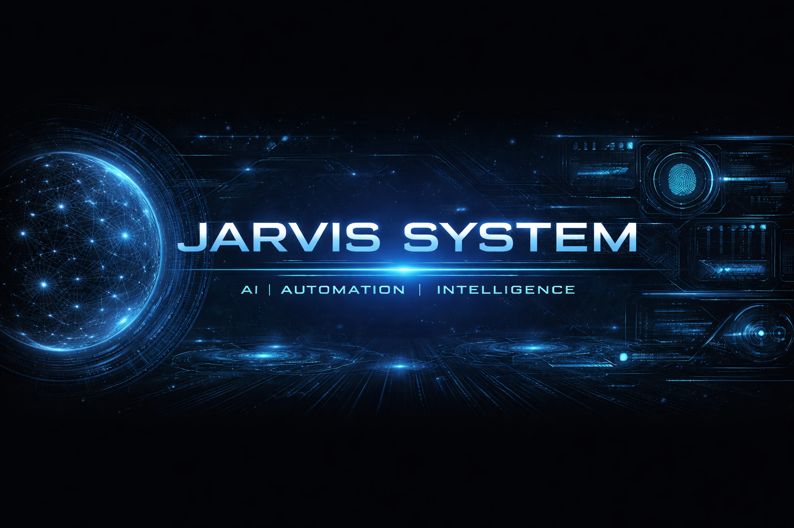

<h1 align="center">🤖 JARVIS SYSTEM</h1>

AI • Automation • Intelligence

  

---

### ⚙️ System Overview
- AI-based assistant system  
- Focused on automation & real-world solutions  
- Continuously evolving with new features  

---

### 🚀 Active Modules
- 🎙 Voice Recognition  
- 🧠 Command Processing  
- ⚡ Automation Engine  
- 📱 Mobile Integration (Upcoming)  

---

### 📡 Status
🟢 Learning  
🟡 Building  
🔵 Improving  

---

### ⚡ Tech Stack
- Python 🐍  
- Java ☕  
- APIs 🌐  
- Android Development 📱  

---

### 📊 System Stats

  

---

### 🔥 Philosophy
> "From commands to intelligence."

---

⚡ SYSTEM ONLINE ⚡

